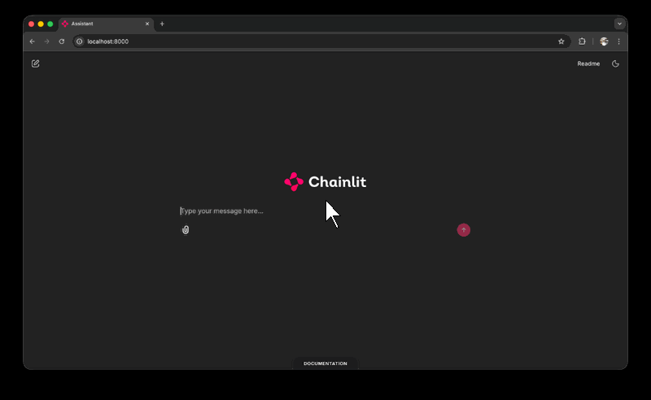

# Chainlit Docked Docs (CLDD)

  

A standalone UI extension for [Chainlit](https://github.com/Chainlit/chainlit) that adds a dockable, collapsible, and theme-aware documentation drawer to your application.



## Features

-   **Dockable Positioning**: Pin the documentation tab to any edge or corner (Bottom, Top, Left, Right, Bottom-Left, Bottom-Right).
-   **Theme Aware**: Automatically adapts to Light/Dark mode settings (requires Chainlit's standard theme classes).
-   **Responsive**: Percentage-based sizing (`vw`/`vh`) that is fully configurable.
-   **Zero Python Dependencies**: Works purely via CSS injection and JavaScript.
-   **Namespace Safe**: All classes and IDs are prefixed with `cldd-` to avoid collisions.

## Installation

### Automated (Recommended)
Run this command in the root of your Chainlit project:
```bash
curl -fsSL https://raw.githubusercontent.com/simingy/cldd/main/install.sh | bash
```

### Manual
1.  **Add Files**: Copy `public/custom.css` and `public/custom.js` to your project's `public/` folder.
2.  **Configure Chainlit**: Edit `.chainlit/config.toml`:
    ```toml
    [UI]
    custom_css = "/public/custom.css"
    custom_js = "/public/custom.js"
    ```

## Configuration

Open `public/custom.js` to change the settings at the top of the file:

```javascript
const CONFIG = {
    // Dock Position: 'bottom', 'bottom-left', 'bottom-right', 'top', 'left', 'right'
    dockPosition: 'bottom', 
    
    // URL to embed (can be local '/docs/' or external)
    docsUrl: 'https://squidfunk.github.io/mkdocs-material/getting-started/',
    
    // Dimensions when expanded
    expandedWidth: '80vw', 
    expandedHeight: '70vh',
    
    // Label Text
    buttonLabel: 'DOCUMENTATION'
};
```

## Usage

-   **Expand**: Hover over the "DOCUMENTATION" tab to peek at the docs.
-   **Maximize**: Click the Maximize icon (`⤢`) to open a full-screen modal with backdrop.
-   **Lock**: The drawer stays open while you interact with the iframe content.

---

Created by [Siming Yuan](https://www.linkedin.com/in/simingy/)
